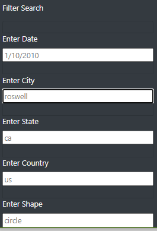
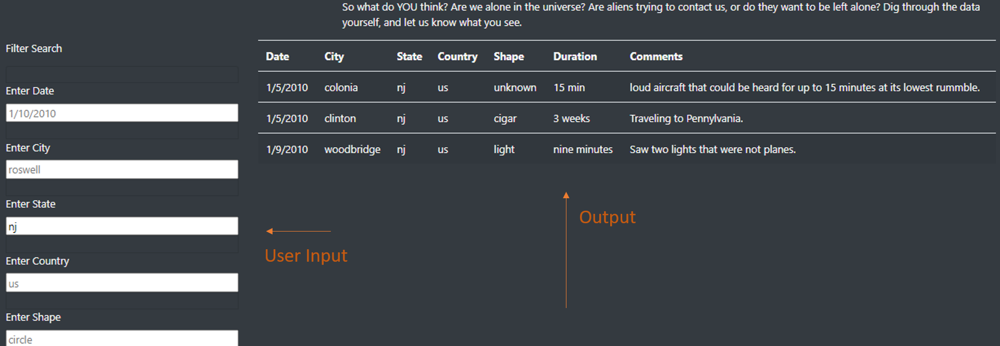
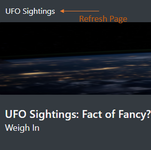
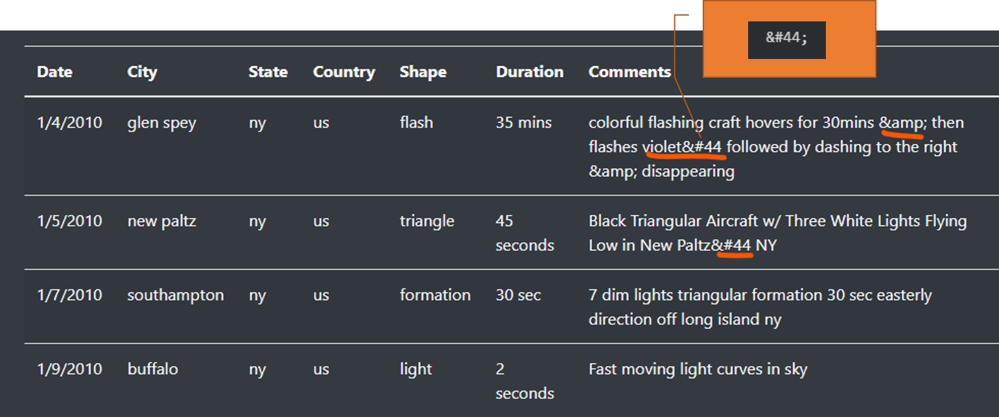

# _Did ya see that?!_ || UFO Sighting Analysis

## Overview of Project 

The intrigue for extra-terrestrial life is a phenomenon that has quite the following! This phenomenon has spawned many movies such as "E.T.", "Alien", "Star Wars", "Men in Black", books as the "The War of the Worlds", television programs as "The X Files", "Star Trek", "The Twilight Zone" and "Stargate SG-1". The appeal of life other than our own has also made it to music, as there are countless songs that reference the term "alien" or the like in their lyrics or title. Even of late, the ever-popular podcast medium has garnered shows that explore the former. Lest not forget the mystery and interests surrounding such locations Roswell, California, and Area 51. Oh, there is a World UFO Day!

In a Google search for the term "UFO" over 164 Billion results were returned in less 0.47 seconds. And, in looking at the data over the last five years via [Google Trends] (https://trends.google.com/trends/explore?hl=en-US&tz=300&date=today+5-y&hl=en-US&q=ufo,%2Fm%2F02m2p&sni=3), both the terms "ufo" and "Extraterrestrial life” appear to have been searched relatively equally, worldwide. Needless to say, this _intrigue_ doesn't appear to be faltering anytime soon.

For enthusiasts like Dana, a data journalist, the very topic (and her hometown of McMinnville, Oregon--famous for its share of UFO sightings) has sparked inspiration for a new article. In additional to the article, Dana would like to present a list of searchable UFO sighting records. 

A centralized interactive webpage was created to incorporate both the written content and a table of recorded sighting data that users or site visitors can filtered by multiple criteria: date, country, city, state, or/and shape.

## Resources

* Data Source(s): [data.js](static/js/data.js)

* Software / Tools: Visual Studio Code, 1.52. 1 | Language (s): JavaScript, HTML, CSS | JavaScript Libraries: D3.js | Bootstrap

##  Results
### At First _"Sight"_...
Upon visiting the webpage (as seen in the below screen grab), user is presented with written content to the right and a search field form to the left. Just below the written content, by default, shows all available data in table format.  

Additional features include a dark background with light colored text, as well as background image and navigation bar. 

 

  <i><b> UFO Sightings Webpage</b></i> 

---
### Navigating The Page

### *One...*

User inputs desired output(s) from available criteria options, in the format shown in said field and hits the enter button {on keyboard}. **Not all** search fields are required to return results. Conversely, *all* search fields can be filled in to yield results. 

     Search Criteria by Format:
        - Enter Date: M/DD/YYYY
        - Enter City, Enter Shape: lowercase, full name
        - Enter Country, Enter State: lowercase, abreviated
 
  

  <i><b> Search Criteria Form</b></i> 
 

  

 ### *Two...*

Search results will appear in area to the right of the search field as a table, below article. 

  <i><b> Enter State Search, "nj"-- 'Full', Results </b></i> 

     

When search conditions do not yield results the output field will be "empty".
 

  <i><b> Enter City Search, "roswell"-- 'Empty', No Results</b></i> 

     

### *Three.*

Clicking on "UFO Sightings" in the navigation bar will refresh the page and clear all previous outputs. 

Other methods: one can simple refresh the page in the address bar or delete content from the fields manually. 

 

  <i><b> UFO Sightings Navagation Bar</b></i> 

    

 >**Notes:**
>* While, the table showcases "Duration" and "Comments" columns, such cannot be searched by user.
>* Some searches will return the following special characters in the "Comment" column of field, an HTML character for comma from  [The HTML Coded Character Set](https://www.w3.org/MarkUp/html-spec/html-spec_13.html#SEC13). 

 

  <i><b> Special Characters</b></i> 
  

     

## Summary 

### Recomendations: 
Though, the webpage provides an easy way to access UFO Sightings, there is always room for improvement to make the experience a bit more engaging. 

- **Reset Search Clickable Button**

    Having an alternative way to clear or reset the search field rather would minimize the need to scroll to top of page or use options provided in previous section. (and anchor link)

 -  **Double Check Dataset**

    As more data becomes available, it is very true said data will present _"cleaner"_ than others, it would be worthwhile to do a check for special nuances as outlined, above. **(add anchor link to previous section) **

    Try to format the data, where possible.  You want our visitors to be access the content in most streamlined way as possible. 

- **Additional Search Options**

    As mentioned, "Duration" and "Comments" cannot be searched, however, for future iterations this can too implemented.  Perhaps, adding a more advance way to search these criteria via drop down menu. 

    Drop-down menus, with tick options can be added alongside the manually search--this would be particularly impact if such were incorporated in the design of the table itself. 

 
 - **Makeover!**

    Periodically, refreshing of the webpage would be welcoming _“sight”_  for a visitor. 

    Yes, the content sparks a great interest in and of itself, yet how it is presented is how we keep engagement. 

    Changing or rearranging the scheme of the webpage from refreshing background images, color combinations, to frequent updates content i.e., articles and/or how data records are displayed can offer a memorable experience that people with continually gravitate to!

#### Author

_Whitney D. Gardner_

 
